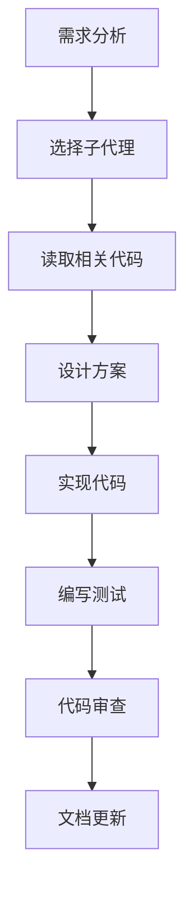

# Spring AI Chat 项目指南

## 📋 项目背景

这是一个系统性学习Spring AI功能的项目，通过实现用户聊天界面来掌握Spring AI的核心能力。

### 项目目标
1. 学会通过API调用大模型能力
2. 掌握Prompt工程，解决大模型幻觉问题
3. 实现Chat Memory，解决大模型记忆缺失
4. 使用Tool Calling，实现大模型与真实世界交互
5. 应用Model Context Protocol (MCP)
6. 掌握RAG（检索增强生成）技术
7. 引入ES对回答进行缓存，减少token消耗
8. **终极目标**: 开发具有思考能力和规划能力的Agent

### 技术栈
- **JDK**: 21
- **Spring Boot**: 3.5.9 (SNAPSHOT) - 要求 >= 3.4.0 且 < 4.0.0-M1
- **AI模型**: OpenAI API (通过New API转发调用)
- **前端框架**: 待定
- **数据存储**: 待定

## 🎯 Claude助手工作规范

### 必须调用的子代理
根据任务类型，必须主动调用以下专业代理：

- **Java/Spring开发** → `java-pro`
- **后端架构设计** → `backend-architect`
- **API设计** → `backend-architect`
- **数据库设计** → `database-architect`
- **性能优化** → `performance-engineer`
- **代码审查** → `code-reviewer`
- **测试编写** → `test-automator`
- **错误调试** → `debugger`
- **AI应用开发** → `ai-engineer`
- **文档编写** → `docs-architect`

### 项目特定约束

#### 1. 技术选型约束
- **必须使用** JDK 21特性（Virtual Threads、Record Patterns等）
- **必须使用** Spring Boot 3.4.0+的新特性
- **禁止使用** 低于Java 21的语法
- **优先使用** Spring AI官方推荐的最佳实践

#### 2. 代码质量标准
```java
// ✅ 正确示例：使用Java 21特性
public record ChatRequest(String message, String sessionId) {}

@RestController
@RequestMapping("/api/chat")
public class ChatController {

    @PostMapping
    public Mono<ChatResponse> chat(@RequestBody ChatRequest request) {
        // 异步响应式处理
    }
}

// ❌ 错误示例：不使用新特性
public class ChatRequest {
    private String message;
    private String sessionId;
    // 传统getter/setter...
}
```

#### 3. AI开发最佳实践

**Prompt工程规范**：
- 必须包含系统提示词、用户提示词分离
- 必须处理幻觉问题（使用上下文限制、结果验证）
- 必须使用模板化Prompt，避免硬编码

**Memory管理**：
- 必须实现会话级别的记忆
- 必须考虑Memory容量限制和清理策略
- 必须区分短期记忆和长期记忆

**Tool Calling实践**：
- 工具定义必须清晰明确
- 必须处理工具调用失败情况
- 必须验证工具返回结果

**RAG实现要求**：
- 必须实现文档切片和向量化
- 必须优化检索相关性
- 必须处理检索结果排序和过滤

**缓存策略**：
- 必须基于语义相似度缓存
- 必须设置合理的缓存过期时间
- 必须考虑缓存一致性

### 工作流程

#### 开发新功能


1. **需求分析阶段**
   - 明确功能需求
   - 确定技术方案
   - 选择合适的子代理

2. **实现阶段**
   - 先读取相关现有代码
   - 遵循项目代码规范
   - 使用Java 21和Spring Boot 3.5特性
   - 编写单元测试和集成测试

3. **验证阶段**
   - 运行测试验证功能
   - 代码审查检查质量
   - 更新相关文档

#### 调试问题
1. 使用 `debugger` 或 `error-detective` 代理
2. 查看完整的错误堆栈
3. 分析Spring Boot日志
4. 检查AI模型调用日志
5. 验证修复方案

### 项目里程碑检查清单

#### 目标1: API调用 ✓/✗
- [ ] 实现基础的OpenAI API调用
- [ ] 处理API调用异常
- [ ] 实现请求重试机制
- [ ] 编写单元测试

#### 目标2: Prompt工程 ✓/✗
- [ ] 设计系统提示词模板
- [ ] 实现Prompt变量注入
- [ ] 添加幻觉检测机制
- [ ] 测试不同Prompt效果

#### 目标3: Chat Memory ✓/✗
- [ ] 实现会话存储
- [ ] 实现记忆检索
- [ ] 添加记忆容量管理
- [ ] 测试多轮对话

#### 目标4: Tool Calling ✓/✗
- [ ] 定义工具接口
- [ ] 实现工具注册
- [ ] 处理工具调用链
- [ ] 测试工具调用场景

#### 目标5: MCP集成 ✓/✗
- [ ] 理解MCP协议
- [ ] 实现MCP客户端
- [ ] 集成到Spring AI
- [ ] 测试MCP功能

#### ���标6: RAG实现 ✓/✗
- [ ] 实现文档加载
- [ ] 实现向量存储
- [ ] 实现相似度检索
- [ ] 优化检索性能

#### 目标7: ES缓存 ✓/✗
- [ ] 配置Elasticsearch
- [ ] 实现语义缓存
- [ ] 实现缓存策略
- [ ] 监控缓存效果

#### 终极目标: 智能Agent ✓/✗
- [ ] 设计Agent架构
- [ ] 实现思考能力（Chain of Thought）
- [ ] 实现规划能力（Planning）
- [ ] 实现自我反思（Reflection）
- [ ] 综合测试Agent能力

## 🔍 关键技术点

### Spring AI核心概念
- **ChatClient**: 统一的聊天客户端接口
- **ChatModel**: 模型抽象层
- **Prompt Template**: 提示词模板
- **Memory Store**: 记忆存储
- **VectorStore**: 向量数据库
- **Embedding**: 向量嵌入

### 性能优化要点
- 使用Virtual Threads处理并发请求
- 实现流式响应（SSE）
- 优化向量检索性能
- 合理使用缓存减少API调用

### 安全注意事项
- 保护API密钥安全
- 验证用户输入，防止注入攻击
- 实现速率限制
- 记录审计日志

## 📚 参考资源

- [Spring AI官方文档](https://docs.spring.io/spring-ai/reference/)
- [OpenAI API文档](https://platform.openai.com/docs/)
- [Java 21新特性](https://openjdk.org/projects/jdk/21/)
- [Spring Boot 3.5文档](https://docs.spring.io/spring-boot/docs/current/reference/html/)
- [DOLIST.md](DOLIST.md)

## 🚀 快速命令

- `/help` - 获取帮助
- `/clear` - 清空上下文（仅在完全重置时使用）
- `#<记忆内容>` - 快速添加记忆

## 新文件要求
- 开发相关的文档(使用中文命名,并且添加序号)放到doc目录下，脚本放到doc/sh目录下，除非必要测试，否则不需要编写脚本
- 创建的测试放到src/test/java相关目录下
---

**最后更新**: 2025-12-01
**维护者**: Claude Code Assistant
